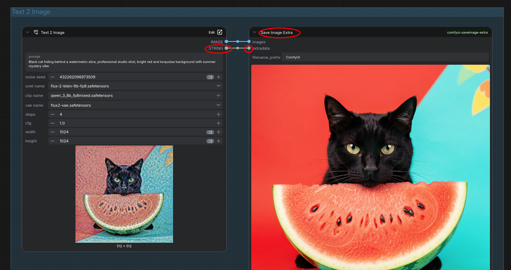
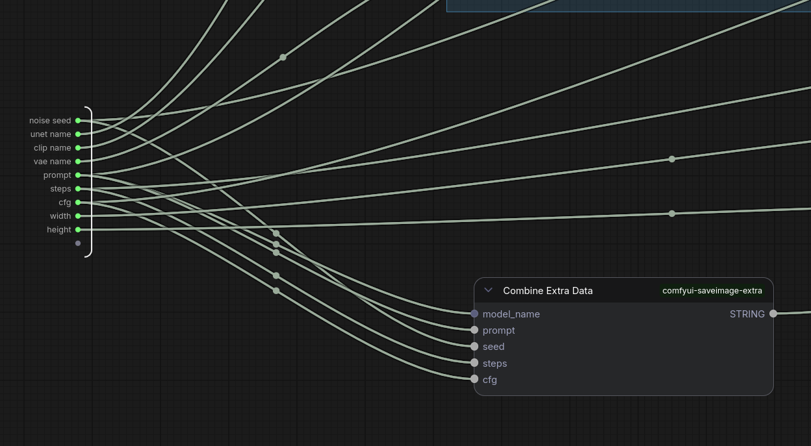
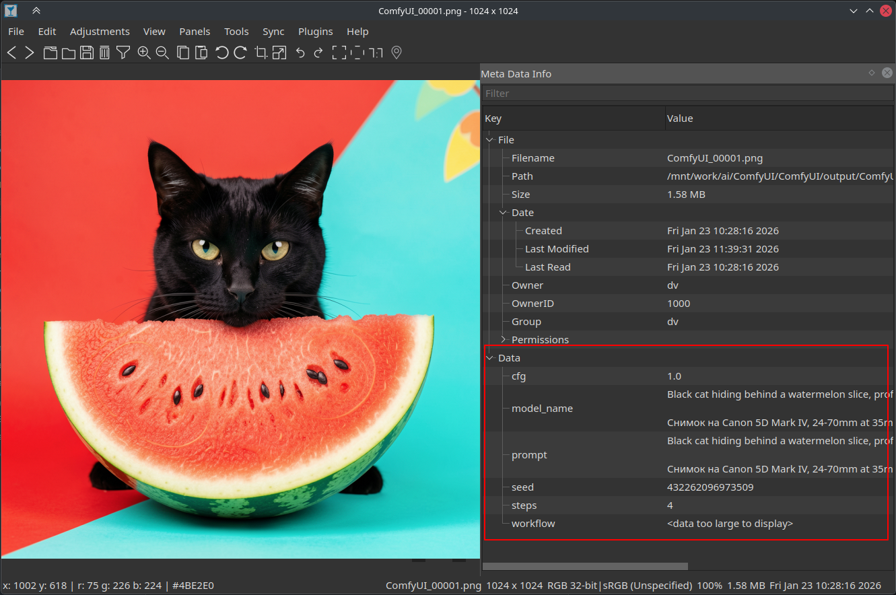

# ComfyUI SaveImage Extra

Custom node for [ComfyUI](https://github.com/comfyanonymous/ComfyUI) that saves images with extra metadata (model name, seed, prompt, etc.) as PNG text chunks.

## Installation

1. Clone this repo into your `ComfyUI/custom_nodes/` folder:

    ```bash
    cd ComfyUI/custom_nodes
    git clone https://github.com/microcoder/comfyui-saveimage-extra.git
    ```

2. Restart ComfyUI

## Nodes

* **Combine Extra Data** — collects parameters into a JSON string and are located in the `utils` category
* **Save Image Extra** — saves image with custom metadata in PNG and are located in the `image` category

## Use Cases

For example ([Download the workflow](_media/Flux-2.Text2Image-Demo.json)):




Then you can view the metadata in the PNG image:



## License

MIT
